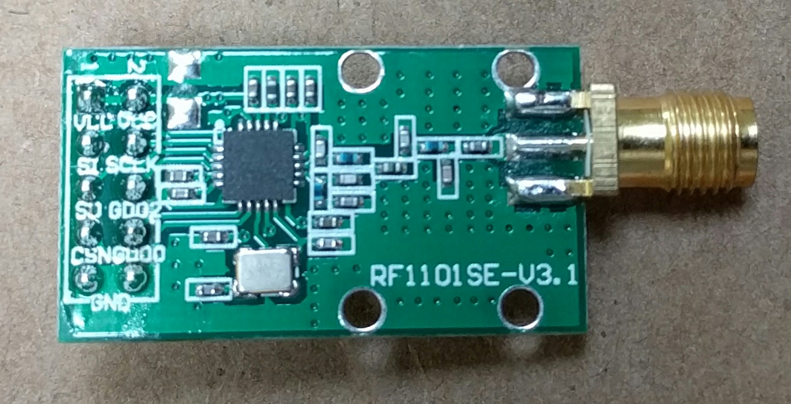

The `cc1101` package provides a Go interface to an SPI-attached
[CC1101 module.](http://www.ti.com/product/CC1101)

A CC1101 module designed for 915MHz
is [available here.](http://www.elechouse.com/elechouse/index.php?main_page=product_info&products_id=2148)

This module comes with a 26MHz crystal, which must be changed to a 24MHz crystal
by following [these instructions.](https://github.com/ps2/rileylink/wiki/Upgrading-to-a-24MHz-crystal)

The current version supports only OOK modulation (on-off keying)
and a proprietary packet format (variable-length, null-terminated).
Patches to support more general use are welcome.

**Note that an antenna must be attached before using the module.**
